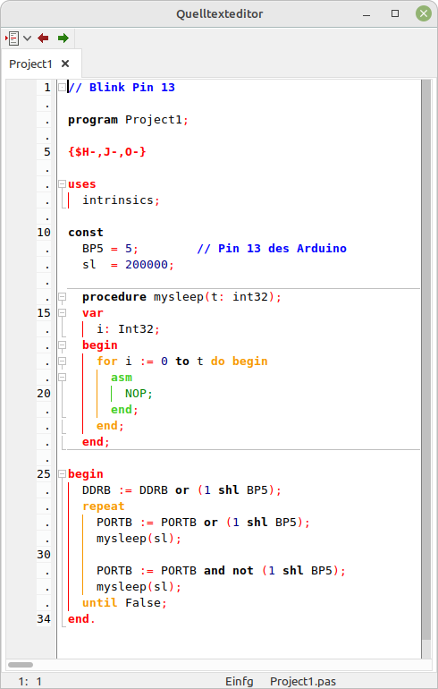

<b>Templates und Examples für die Embedded GUI</b>

Hier befinden sich die Templates/Examples-Dateien, welche für die Embedded GUI braucht.
In Lazarus muss unter <i>"Werkzeuge->Einstellungen->[Embedded] Optionen->Templates"</i> den Pfad dorthin eingestellt werden.

 
