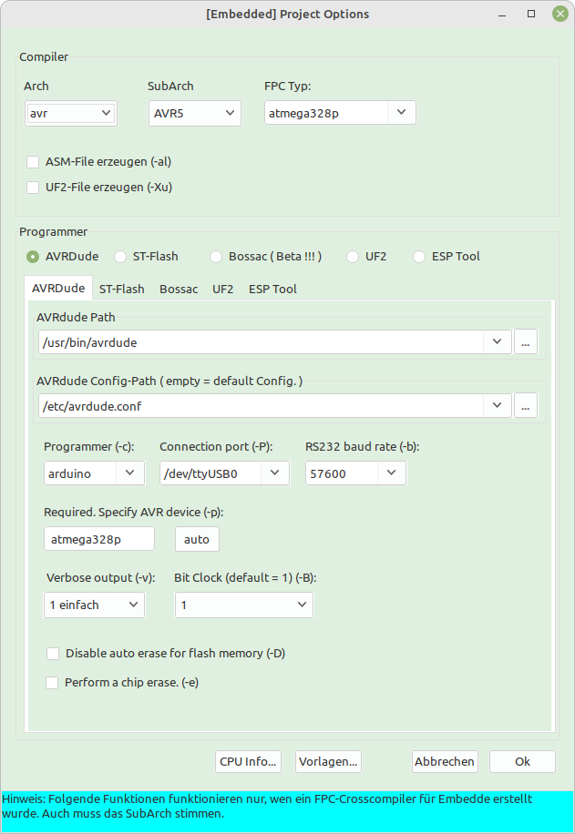
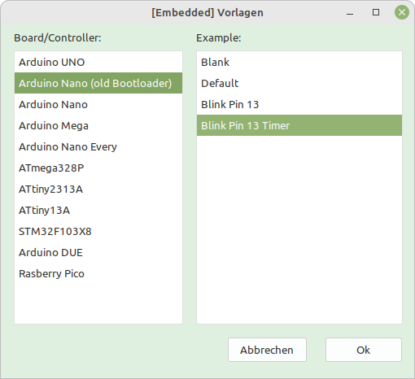

## GERMAN:
### Lazarus Embedded GUI 

Mit dieser GUI für Lazarus hat man den Vorteil, das man sehr einfach Projekte für Embedded System entwickeln kann.
Der Vorteil der Package, es werden einem fast alle Einstellung für Compiler und Programmer abgenommen.

#### Stand der Entwicklung 21.09.2022
Die AVRs werden schon sehr gut unterstützt, vor allem die gewöhnlichen Arduinos.
Für den Arduino UNO hat es schon recht viele Beispiele.
Es werden immer mehr, auch für nicht Arduino.
STM-32, Arduino DUO, ESPxxx und Rasberry Pico gehen auch, nur fehlen (noch) die Beispiele.

#### Download:
https://github.com/sechshelme/Lazarus-Embedded

#### Installation:
Bei Lazarus bei "Package/Package Datei (.lpi) offnen .../"
Anschliessend diese Datei öffnen, kompilieren und installieren. ./Lazarus_Embedded_GUI_Package/embedded_gui_package.lpk

#### Beispiel für einen Arduino:
Über "Datei --> Neu... --> Project --> [Embedded] Embedded-Project --> Vorlagen... --> Arduino UNO --> Blink Pin 13 --> Ok --> Ok"
kann dann ein Arduino UNO Project erstellt werden.
Wen man zu Laufzeit noch was ändern will, kann man über "Project --> [Embedded] Optionen" die Werte editieren.

#### Schlusswort:
Die Package wird unter Linux entwickelt, daher kann es unter Windows noch Fehler haben.
Voraussetzung ist ein funktionstüchtige Embedded-Cross-Compiler.
Für Feedbacks bin ich immer dankbar, egal, ob sie direkt ins Forum https://forum.lazarus.freepascal.org/index.php?topic=60667.msg454548#msg454548 oder bei den Issus gepostet werden ;)

## ENGLISH:
### Lazarus Embedded GUI

With this GUI for Lazarus you have the advantage that you can easily develop projects for embedded systems.
The advantage of the package, almost all settings for compilers and programmers are taken care of.

#### State of development 09/21/2022
The AVRs are already very well supported, especially the ordinary Arduinos.
There are quite a few examples for the Arduino UNO.
There are more and more, even for non-Arduino.
STM-32, Arduino DUO, ESPxxx and Rasberry Pico also work, only the examples are (still) missing.

#### Downloads:
https://github.com/sechshelme/Lazarus-Embedded

#### Installation:
At Lazarus at "Open Package/Package File (.lpi) .../"
Then open this file, compile and install it. ./Lazarus_Embedded_GUI_Package/embedded_gui_package.lpk

#### Example for an Arduino:
Via "File --> New... --> Project --> [Embedded] Embedded-Project --> Templates... --> Arduino UNO --> Blink Pin 13 --> Ok --> Ok"
an Arduino UNO Project can then be created.
If you want to change something at runtime, you can edit the values ​​via "Project --> [Embedded] Options".

#### Closing words:
The package is developed under Linux, so it may still have bugs under Windows.
A functional embedded cross compiler is required.
I'm always grateful for feedback, regardless of whether it's posted directly in the forum https://forum.lazarus.freepascal.org/index.php?topic=60667.msg454548#msg454548 or in the Issus ;)

