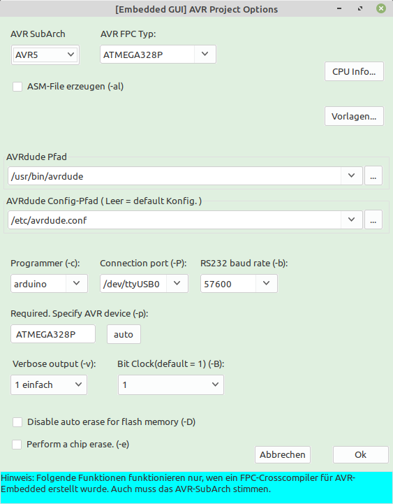

<b>Lazarus Arduino/AVR GUI</b> (german)

Mit dieser Package wird Lazarus mit einer GUI für Arduino/AVR erweitert.
Damit werden alle Parameter für ein AVR-Project gesetzt, inklusive den AVRDude Aufruf.

Somit kann man mit <i>"Datei/neu.../Project/AVR-Project (Arduino)"</i> direkt ein AVR-Project erstellen.
Nachträglich kann man mit <i>"Projekt/AVR-Optionen (Arduino)..."</i> die Parameter editieren.

Voraussetzung ist ein funktionstüchtige AVR-Cross-Compiler.

Die Package befindet sich unter: Lazarus_Arduino_AVR_GUI_Package

   
<b> Lazarus Arduino / AVR GUI </b> (english)

This package extends Lazarus with a GUI for Arduino / AVR.
This sets all parameters for an AVR project, including the AVRDude call.

So you can directly create an AVR project with <i> "File / new ... / Project / AVR-Project (Arduino)" </i>.
You can edit the parameters later with <i> "Project / AVR options (Arduino) ..." </i>.

A working AVR cross compiler is required.

The package is located at: Lazarus_Arduino_AVR_GUI_Package

