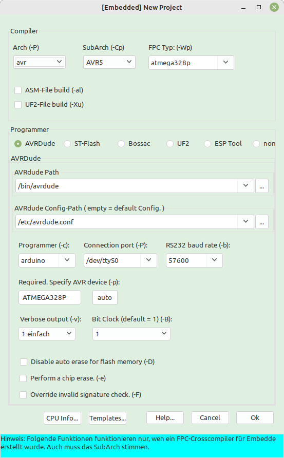

## Lazarus Arduino/ AVR / STM32 / ARM GUI (german)

Mit dieser Package wird Lazarus mit einer GUI für Embedded Systeme erweitert.
Damit kann man einfach Parameter für ein Embedded-Projekt setzen, inklusive den Flasher-Aufruf.

Somit kann man mit <i>"Datei->Neu...->Projekt->Embedded-Project"</i> direkt ein Embedded-Project erstellen.
Nachträglich kann man mit <i>"Projekt->Embedded-Optionen..."</i> die Parameter editieren.

Voraussetzung ist ein funktionstüchtige Embedded-Cross-Compiler.

Die Package befindet sich unter: <b>Lazarus_Embedded_GUI_Package</b>
   

## Lazarus Arduino/ AVR / STM32 / ARM GUI (english)

With this package, Lazarus is extended with a GUI for embedded systems.
With this you can easily set parameters for an embedded project, including the flasher call.

So you can create an embedded project directly with <i>"File->New...->Project->Embedded-Project"</i>.
You can edit the parameters afterwards with <i>"Project->Embedded-Options..."</i>.

A functional embedded cross compiler is required.

The package is located at: <b>Lazarus_Embedded_GUI_Package</b>
   

## Lazarus Embedded GUI

Ich bin schon seit längerem an einer GUI am entwickeln, mit der man sehr einfach Programme für Embedded Systeme erstellen kann.
Der Vorteil der Package, es werden einem fast alle Einstellung für Compiler und Programmer abgenommen.

Die AVRs werden schon sehr gut unterstützt, vor allem die gewöhnlichen Arduinos.
Für den Arduino UNO hat es schon recht viele Beispiele.
Es werden immer mehr, auch für nicht Arduino.
STM-32, Arduino DUO, ESPxxx und Rasberry Pico gehen auch, nur fehlen (noch) die Beispiele.

### Download:
https://github.com/sechshelme/Lazarus-Embedded

### Installation:
Bei Lazarus bei "Package/Package Datei (.lpi) offnen .../"
Anschliessend diese Datei öffnen, kompilieren und installieren. ./Lazarus_Embedded_GUI_Package/embedded_gui_package.lpk

### Beispiel für einen Arduino:
Über "Datei --> Neu... --> Project --> [Embedded] Embedded-Project --> Vorlagen... --> Arduino UNO --> Blink Pin 13 --> Ok --> Ok"
kann dann ein Arduino UNO Project erstellt werden.
Wen man zu Laufzeit noch was ändern will, kann man über "Project --> [Embedded] Optionen" die Werte editieren.

### Schlusswort:
Die Package wird unter Linux entwickelt, daher kann es unter Windows noch Fehler haben.
Voraussetzung ist ein funktionstüchtige Embedded-Cross-Compiler.
Für Feedbacks bin ich immer dankbar, egal, ob sie direkt ins Forum https://forum.lazarus.freepascal.org/index.php?topic=60667.msg454548#msg454548 oder bei den Issus gepostet werden ;)
